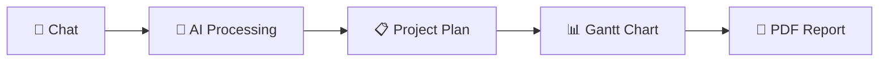
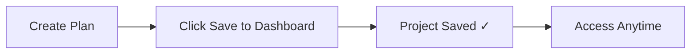
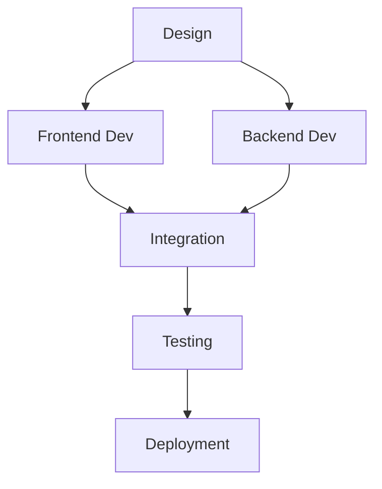
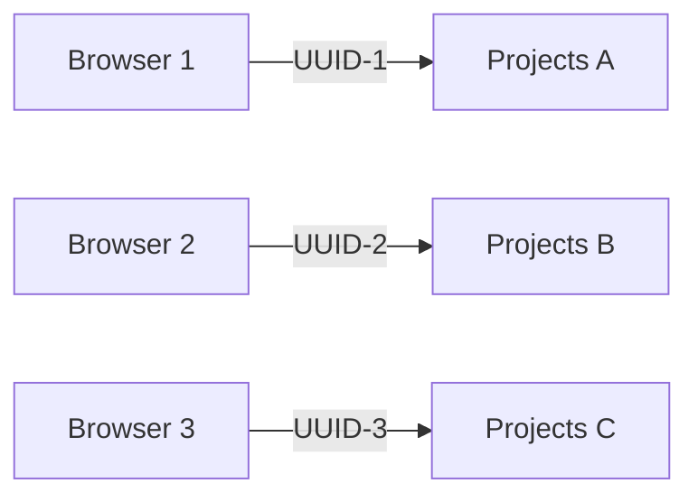

<div align="center">

# 📊 Incept AI - User Documentation

### *AI-Powered Project Planning Made Simple*

[](https://github.com)
[](https://github.com)
[](https://github.com)

</div>

---

## 📑 Table of Contents

<table>
<tr>
<td width="50%">

**🚀 Getting Started**
- [Introduction](#-getting-started)
- [Quick Start Guide](#quick-start)
- [What You Can Do](#what-you-can-do)

**📝 Core Features**
- [Creating Projects](#-creating-your-first-project)
- [Understanding Interface](#-understanding-the-interface)
- [Modifying Plans](#-modifying-your-project-plan)

</td>
<td width="50%">

**📈 Advanced Features**
- [Timeline Reports](#-viewing-timeline-reports)
- [Project Management](#-managing-projects)
- [Exporting Reports](#-exporting-reports)

**💡 Resources**
- [Tips & Best Practices](#-tips--best-practices)
- [Troubleshooting](#-troubleshooting)
- [FAQ](#need-more-help)

</td>
</tr>
</table>

---

## 🚀 Getting Started

> **Incept AI** is an AI-powered project planning tool that converts natural conversations into structured project timelines with Gantt charts.

<div align="center">



</div>

### ✨ What You Can Do

<table>
<tr>
<td align="center" width="33%">


**Natural Conversation**

Create project plans through natural language chat

</td>
<td align="center" width="33%">


**Visual Gantt Charts**

Generate interactive timelines automatically

</td>
<td align="center" width="33%">


**PDF Reports**

Export professional project documentation

</td>
</tr>
<tr>
<td align="center" width="33%">


**Task Tracking**

Monitor tasks, owners, and dependencies

</td>
<td align="center" width="33%">


**Project Management**

Save and manage multiple projects

</td>
<td align="center" width="33%">


**Live Modifications**

Update plans on the fly with AI

</td>
</tr>
</table>

### 🎯 Quick Start

```
Step 1: Click "Get Started" on the landing page
   ↓
Step 2: Describe your project in the chat
   ↓
Step 3: Review the generated plan
   ↓
Step 4: View the Gantt chart visualization
   ↓
Step 5: Save to your dashboard
```

<div align="center">

**⏱️ Time to first project: Less than 2 minutes!**

</div>

---

## 📝 Creating Your First Project

### 🎨 Step 1: Describe Your Project

Start by telling the AI what you want to build. Be specific about:

<table>
<tr>
<td width="33%" align="center">
<b>🎯 Project Goal</b><br/>
<i>What you're building</i>
</td>
<td width="33%" align="center">
<b>⏰ Timeline</b><br/>
<i>How long you have</i>
</td>
<td width="33%" align="center">
<b>📋 Requirements</b><br/>
<i>What needs to be done</i>
</td>
</tr>
</table>

> **💡 Example:**
> ```
> "Build a portfolio website in 2 weeks with design, frontend development, 
> backend API, and deployment"
> ```

### ⏱️ Step 2: Specify Timeline

If you didn't mention a timeline, the AI will ask for it:

| Format | Example |
|--------|---------|
| 📅 Weeks | "2 weeks" |
| 📆 Days | "30 days" |
| 🗓️ Months | "3 months" |
| ⏳ Relative | "in 45 days" |

### 📊 Step 3: Review Generated Plan

The AI creates a structured plan with:

```
✓ Project name
✓ Total duration
✓ List of tasks
✓ Task owners
✓ Dependencies
```

### 📈 Step 4: View Gantt Chart

Click **"View Gantt Chart & Export PDF"** to see:

<div align="center">

| Feature | Description |
|---------|-------------|
| 📅 **Visual Timeline** | See your entire project at a glance |
| ⏱️ **Task Durations** | Color-coded bars showing time allocation |
| 👥 **Team Workload** | Distribution chart by team member |
| 📝 **Task Breakdown** | Detailed information for each task |

</div>

---

## 🖥️ Understanding the Interface

### 🏠 Landing Page

<table>
<tr>
<td width="50%" align="center">
<h3>🚀 Get Started</h3>
Create a new project from scratch
</td>
<td width="50%" align="center">
<h3>📊 View Dashboard</h3>
See all your saved projects
</td>
</tr>
</table>

---

### 🎨 Project Planner (Split View)

<div align="center">

```
┌─────────────────────────────────────────────────────────────┐
│  🏠 Back  |  Incept AI  |  📊 My Projects  |  ➕ New Project │
├──────────────────────────┬──────────────────────────────────┤
│                          │                                  │
│   💬 PROJECT CHAT        │   📋 PLAN PREVIEW                │
│                          │                                  │
│  • Chat with AI          │  • Project structure             │
│  • Define project        │  • Task list                     │
│  • Modify plans          │  • Quick actions                 │
│  • Real-time feedback    │  • Save/Export                   │
│                          │                                  │
└──────────────────────────┴──────────────────────────────────┘
```

</div>

<table>
<tr>
<td width="50%">

#### 💬 Left Panel - Project Chat
- 🤖 Chat with AI to define your project
- ✏️ Modify existing plans
- ⚡ Get real-time feedback
- 💡 Conversational interface

</td>
<td width="50%">

#### 📋 Right Panel - Plan Preview
- 👀 See your project structure
- ✅ Review tasks and durations
- 🎯 Quick access to actions
- 💾 Save to dashboard

</td>
</tr>
</table>

#### 🎛️ Header Actions

| Button | Icon | Function |
|--------|------|----------|
| **My Projects** | 📊 | View dashboard |
| **New Project** | ➕ | Start fresh |
| **Back Arrow** | ⬅️ | Return to landing page |

---

### 📊 Project Dashboard

<div align="center">

**Your Project Command Center**

</div>

<table>
<tr>
<td width="25%" align="center">
<h4>📱 Grid View</h4>
All saved projects in cards
</td>
<td width="25%" align="center">
<h4>📈 Project Stats</h4>
Duration, tasks, team size
</td>
<td width="25%" align="center">
<h4>⚡ Quick Actions</h4>
Edit, Delete, Mark Complete
</td>
<td width="25%" align="center">
<h4>🏠 Navigation</h4>
Home, Clear All Data
</td>
</tr>
</table>

---

### 📈 Timeline Report (Modal)

<div align="center">

```
╔═══════════════════════════════════════════════════════════╗
║  📊 Project Timeline Report                               ║
║  ─────────────────────────────────────────────────────── ║
║                                                           ║
║  📋 Executive Summary                                     ║
║  ├─ Total Tasks: 8                                        ║
║  ├─ Duration: 14 days                                     ║
║  └─ Team: 3 members                                       ║
║                                                           ║
║  📅 Interactive Gantt Chart                               ║
║  ├─ Date-based timeline                                   ║
║  ├─ Task dependencies                                     ║
║  └─ Hover for details                                     ║
║                                                           ║
║  📊 Workload Distribution                                 ║
║  └─ Bar chart by team member                              ║
║                                                           ║
║  📝 Detailed Task Breakdown                               ║
║  └─ Complete task information                             ║
║                                                           ║
║  👥 Team Allocation                                       ║
║  └─ Tasks per team member                                 ║
║                                                           ║
║  [📥 Download PDF]  [🏠 Back to Home]  [✖️ Close]         ║
╚═══════════════════════════════════════════════════════════╝
```

</div>

---

## ✏️ Modifying Your Project Plan

<div align="center">

**🎯 Four Ways to Modify Your Plan**

</div>

<table>
<tr>
<td width="50%">

### ➕ Adding Tasks

```diff
+ "Add a testing phase after development"
+ "Include SEO optimization"
```

**Result:** ✅ New tasks added to timeline

</td>
<td width="50%">

### ➖ Removing Tasks

```diff
- "Remove the backend development task"
- "Don't need the deployment phase"
```

**Result:** ✅ Tasks removed from plan

</td>
</tr>
<tr>
<td width="50%">

### ⏱️ Changing Durations

```diff
~ "Make backend development 5 days"
~ "Extend the design phase to 1 week"
```

**Result:** ✅ Task durations updated

</td>
<td width="50%">

### 🔄 Restructuring

```diff
* "Divide this into 6 tasks"
* "Break the project into only 4 phases"
```

**Result:** ✅ Plan reorganized

</td>
</tr>
</table>

---

### 📊 The AI Will Show You:

<div align="center">

| Change Type | Indicator | Description |
|-------------|-----------|-------------|
| 📈 **Increased** | `[INCREASED]` | Task duration extended |
| 📉 **Decreased** | `[DECREASED]` | Task duration reduced |
| ➕ **Added** | `• New Task` | Tasks added to plan |
| ➖ **Removed** | `• Old Task` | Tasks removed from plan |

</div>

> **💡 Pro Tip:** The AI provides a detailed summary of all changes after each modification!

---

## 📈 Viewing Timeline Reports

### 📋 Executive Summary

<div align="center">

**At-a-Glance Project Metrics**

</div>

<table>
<tr>
<td width="33%" align="center">
<h3>📊</h3>
<b>Total Tasks</b><br/>
Number of project tasks
</td>
<td width="33%" align="center">
<h3>⏱️</h3>
<b>Project Duration</b><br/>
Timeline in days
</td>
<td width="33%" align="center">
<h3>👥</h3>
<b>Team Members</b><br/>
Resource count
</td>
</tr>
</table>

---

### 📅 Gantt Chart

<div align="center">

```
Day 0    Day 5    Day 10   Day 15   Day 20
  │────────│────────│────────│────────│
  ████████                              Task 1: Design (8d)
          ████████████                  Task 2: Development (12d)
                      ████              Task 3: Testing (4d)
                          ████          Task 4: Deploy (4d)
```

</div>

| Feature | Description |
|---------|-------------|
| 📆 **Date-based Timeline** | Shows actual dates (DD/MM format) |
| ⬛ **Task Bars** | Black bars show task duration |
| 🖱️ **Hover for Details** | See task info, dates, owner, dependencies |
| 🔗 **Visual Dependencies** | See which tasks depend on others |

---

### 📊 Workload Distribution

<div align="center">

**Bar Chart: Days Allocated Per Team Member**

```
Developer    ████████████████ 16 days
Designer     ██████████ 10 days
QA Tester    ████ 4 days
```

</div>

> **💡 Helps identify:** Resource bottlenecks and workload balance

✨ **Interactive tooltips** show task counts and details

---

### 📝 Task Breakdown

<table>
<tr>
<td width="25%" align="center">
<b>🆔 Task ID</b><br/>
Unique identifier
</td>
<td width="25%" align="center">
<b>📌 Task Name</b><br/>
Description
</td>
<td width="25%" align="center">
<b>👤 Owner</b><br/>
Assigned person
</td>
<td width="25%" align="center">
<b>⏱️ Duration</b><br/>
Time allocation
</td>
</tr>
</table>

**Plus:** Start day, dependencies (if any), and status

---

### 👥 Team Allocation

<div align="center">

**Tasks Per Team Member**

| Team Member | Tasks | Total Days | Utilization |
|-------------|-------|------------|-------------|
| 👨‍💻 Developer | 5 tasks | 16 days | 80% |
| 🎨 Designer | 3 tasks | 10 days | 50% |
| 🧪 QA Tester | 2 tasks | 4 days | 20% |

</div>

---

## 💼 Managing Projects

### 💾 Saving Projects

<div align="center">



</div>

| Step | Action | Result |
|------|--------|--------|
| 1️⃣ | Create or modify a plan | Plan ready |
| 2️⃣ | Click **"Save to Dashboard"** | Saved with timestamp |
| 3️⃣ | Access from Dashboard | Available anytime |

---

### ✏️ Editing Projects

<table>
<tr>
<td width="25%" align="center">
<h3>1️⃣</h3>
Go to Dashboard
</td>
<td width="25%" align="center">
<h3>2️⃣</h3>
Click Edit icon ✏️
</td>
<td width="25%" align="center">
<h3>3️⃣</h3>
Make changes
</td>
<td width="25%" align="center">
<h3>4️⃣</h3>
Save update
</td>
</tr>
</table>

---

### 🗑️ Deleting Projects

> **⚠️ Warning:** Deletion is permanent!

```
Dashboard → Click Delete icon 🗑️ → Confirm → Project Removed ✓
```

---

### ✅ Marking Complete

<div align="center">

| Status | Icon | Appearance |
|--------|------|------------|
| **Active** | ⭕ | Normal display |
| **Complete** | ✅ | Strikethrough text |
| **Toggle** | 🔄 | Click to switch |

</div>

---

### 👀 Viewing Projects

<table>
<tr>
<td width="33%" align="center">
<h3>📱</h3>
<b>Click Project Card</b><br/>
Opens Timeline Report
</td>
<td width="33%" align="center">
<h3>📊</h3>
<b>View Gantt Chart</b><br/>
Full visualization
</td>
<td width="33%" align="center">
<h3>📥</h3>
<b>Download PDF</b><br/>
Export report
</td>
</tr>
</table>

---

## 📥 Exporting Reports

### 📄 PDF Report Includes:

<div align="center">

```
┌─────────────────────────────────────┐
│  📑 COVER PAGE                      │
│  Project name & key info            │
├─────────────────────────────────────┤
│  📋 EXECUTIVE SUMMARY               │
│  Overview & metrics                 │
├─────────────────────────────────────┤
│  📊 GANTT CHART                     │
│  Visual timeline with all tasks     │
├─────────────────────────────────────┤
│  📝 TASK BREAKDOWN                  │
│  Detailed task information          │
├─────────────────────────────────────┤
│  👥 RESOURCE ALLOCATION             │
│  Team member workload               │
├─────────────────────────────────────┤
│  ⚠️ RISK ASSESSMENT                 │
│  Dependencies & critical path       │
└─────────────────────────────────────┘
```

</div>

---

### 🚀 How to Export:

<table>
<tr>
<td width="33%" align="center">
<h3>1️⃣</h3>
<b>Open Timeline Report</b><br/>
From planner or dashboard
</td>
<td width="33%" align="center">
<h3>2️⃣</h3>
<b>Click Download PDF</b><br/>
Button in header
</td>
<td width="33%" align="center">
<h3>3️⃣</h3>
<b>PDF Saved</b><br/>
Auto-named with project
</td>
</tr>
</table>

---

### ✨ PDF Features:

<div align="center">

| Feature | Description |
|---------|-------------|
| 🎨 **Professional Design** | Black and white theme |
| 📄 **Multi-page Layout** | Automatic page breaks |
| 🔢 **Page Numbers** | Footer with navigation |
| 📌 **Project Info** | Header on every page |
| 🖨️ **Print-ready** | Optimized for printing |
| 📊 **Charts Included** | Gantt & bar charts |

</div>

> **💡 Pro Tip:** PDF filename automatically includes your project name!

---

## 💡 Tips & Best Practices

### ✍️ Writing Good Project Descriptions

<table>
<tr>
<td width="50%">

#### ✅ Good Example

```
"Build an e-commerce website in 6 weeks 
with product catalog, shopping cart, 
payment integration, and admin dashboard"
```

**Why it works:**
- ✓ Clear goal
- ✓ Specific timeline
- ✓ Detailed requirements

</td>
<td width="50%">

#### ❌ Too Vague

```
"Make a website"
```

**Why it fails:**
- ✗ No timeline
- ✗ No specifics
- ✗ No requirements

</td>
</tr>
</table>

---

### ⏱️ Specifying Timelines

<div align="center">

| ✅ Do | ❌ Don't |
|-------|----------|
| Be realistic about durations | Set impossible deadlines |
| Consider team size | Ignore resource constraints |
| Account for dependencies | Assume parallel work |
| Trust AI adjustments | Force unrealistic timelines |

</div>

> **💡 Pro Tip:** The AI will adjust if your timeline seems unrealistic!

---

### 🔧 Task Modifications

<table>
<tr>
<td width="50%" align="center">

#### ✅ Specific

```
"Make backend development 5 days"
```

**Clear and actionable**

</td>
<td width="50%" align="center">

#### ❌ Vague

```
"Make it longer"
```

**Ambiguous request**

</td>
</tr>
</table>

**Best Practices:**
- 🎯 One change at a time for clarity
- 📊 Review the changes summary after each modification
- 💬 Use specific numbers and task names

---

### 🔗 Using Dependencies

<div align="center">



</div>

| Feature | Description |
|---------|-------------|
| 🤖 **Auto-Detection** | AI identifies logical dependencies |
| 🔴 **Visual Indicator** | Dependent tasks show in red |
| ⚡ **Proper Sequencing** | Ensures correct task order |

---

### 👥 Team Roles

<div align="center">

**AI Adapts Role Names to Your Project Type**

</div>

<table>
<tr>
<td width="33%">

#### 💻 Software
- Developer
- Designer
- QA Tester
- DevOps Engineer

</td>
<td width="33%">

#### 📢 Marketing
- Content Writer
- Marketing Manager
- SEO Specialist
- Social Media Manager

</td>
<td width="33%">

#### 🔬 Research
- Researcher
- Data Analyst
- Writer
- Reviewer

</td>
</tr>
</table>

---

## 🔧 Troubleshooting

<div align="center">

**Common Issues & Solutions**

</div>

---

### 🔍 "I don't see my saved projects"

<table>
<tr>
<td width="50%">

#### 🔴 Problem
Projects disappeared after closing browser

</td>
<td width="50%">

#### 🟢 Solution
- Check **"My Projects"** dashboard
- Projects saved per browser (localStorage)
- Use same browser/device
- Don't clear browser data

</td>
</tr>
</table>

---

### 🤖 "The AI didn't understand my request"

<div align="center">

| Issue | Solution |
|-------|----------|
| ❌ Vague description | ✅ Be more specific |
| ❌ No timeline | ✅ Include duration |
| ❌ Unclear tasks | ✅ Mention key phases |
| ❌ Complex request | ✅ Try rephrasing |

</div>

---

### ⏱️ "Timeline seems too short/long"

```diff
Problem: "14 days seems too short for this project"

Solution:
+ "Make the timeline 4 weeks instead"
+ "Extend backend development to 7 days"
+ Modify individual task durations
```

> **💡 Note:** AI estimates based on task complexity - adjust as needed!

---

### 📊 "Can't see the full Gantt chart"

<table>
<tr>
<td width="33%" align="center">
<h3>↔️</h3>
<b>Scroll Horizontally</b><br/>
See all dates
</td>
<td width="33%" align="center">
<h3>🔍</h3>
<b>Zoom Out</b><br/>
Ctrl/Cmd + -
</td>
<td width="33%" align="center">
<h3>🖥️</h3>
<b>Larger Screen</b><br/>
Better visibility
</td>
</tr>
</table>

---

### 📥 "PDF download isn't working"

<div align="center">

**Checklist:**

</div>

- [ ] Check popup blocker settings
- [ ] Ensure JavaScript is enabled
- [ ] Try Chrome browser (recommended)
- [ ] Check browser console for errors
- [ ] Disable browser extensions temporarily

---

### 💾 "Lost my project after refresh"

```
Step 1: Click "My Projects" → Check dashboard
   ↓
Step 2: If not there → Was it saved?
   ↓
Step 3: Projects only persist if "Save to Dashboard" was clicked
   ↓
Step 4: If not saved → Recreate project
```

> **⚠️ Remember:** Always click **"Save to Dashboard"** to persist projects!

---

### 🔄 "Want to start over"

<table>
<tr>
<td width="50%" align="center">

#### 🆕 New Project

```
Click "New Project" button
↓
Confirm clearing current work
↓
Start fresh
```

</td>
<td width="50%" align="center">

#### 🗑️ Clear All Data

```
Dashboard → "Clear All Data"
↓
Confirm deletion
↓
All projects removed
```

</td>
</tr>
</table>

> **⚠️ Warning:** Both actions require confirmation!

---

## ⌨️ Keyboard Shortcuts

<div align="center">

| Shortcut | Action |
|----------|--------|
| `Enter` | Send message in chat |
| `Esc` | Close Timeline Report modal |
| `Ctrl/Cmd + P` | Print Timeline Report |

</div>

---

## 🔒 Data Privacy

### 💾 What's Stored Locally:

<table>
<tr>
<td width="33%" align="center">
<h3>📋</h3>
<b>Project Plans</b><br/>
Your project data
</td>
<td width="33%" align="center">
<h3>💬</h3>
<b>Chat History</b><br/>
Conversation logs
</td>
<td width="33%" align="center">
<h3>🆔</h3>
<b>Anonymous ID</b><br/>
UUID for multi-user
</td>
</tr>
</table>

---

### 🚫 What's NOT Stored:

<div align="center">

```
✗ No personal information
✗ No account required
✗ No server-side storage
✗ Data stays in your browser
```

</div>

---

### 👥 Multi-User Support:

<div align="center">



</div>

> **🔐 Privacy:** Each browser gets a unique anonymous ID - your projects won't mix!

---

## 🛠️ Technical Details

### 🌐 Browser Requirements:

<table>
<tr>
<td width="25%" align="center">
<h3>✅</h3>
<b>Chrome</b><br/>
Recommended
</td>
<td width="25%" align="center">
<h3>✅</h3>
<b>Firefox</b><br/>
Supported
</td>
<td width="25%" align="center">
<h3>✅</h3>
<b>Safari</b><br/>
Supported
</td>
<td width="25%" align="center">
<h3>✅</h3>
<b>Edge</b><br/>
Supported
</td>
</tr>
</table>

**Requirements:**
- ✓ JavaScript enabled
- ✓ LocalStorage enabled
- ✓ Minimum 1280px width recommended

---

### 📂 Supported Project Types:

<div align="center">

| Category | Examples |
|----------|----------|
| 💻 **Software** | Web apps, Mobile apps, APIs |
| 📢 **Marketing** | Campaigns, Content, SEO |
| 🔬 **Research** | Studies, Analysis, Papers |
| 🎉 **Events** | Conferences, Launches, Webinars |
| 📦 **Product** | Development, Launch, Iteration |
| ✍️ **Content** | Writing, Editing, Publishing |

</div>

> **💡 Flexible:** Any structured project with tasks and timelines!

---

### 🤖 AI Model:

<table>
<tr>
<td width="25%" align="center">
<h3>⚡</h3>
<b>Groq</b><br/>
Lightning fast
</td>
<td width="25%" align="center">
<h3>🧠</h3>
<b>Llama 3.3 70B</b><br/>
Powerful model
</td>
<td width="25%" align="center">
<h3>🎯</h3>
<b>Optimized</b><br/>
For planning
</td>
<td width="25%" align="center">
<h3>✅</h3>
<b>Validated</b><br/>
Dependencies
</td>
</tr>
</table>

---

## ❓ Need More Help?

### 💬 Common Questions

<details>
<summary><b>Q: Can I share my project with others?</b></summary>

<br/>

**A:** Currently, projects are stored locally. You can share the exported PDF report.

📥 **Workaround:** Export PDF and share via email or cloud storage

</details>

<details>
<summary><b>Q: Is there a limit to project size?</b></summary>

<br/>

**A:** No hard limit, but 5-15 tasks is optimal for readability.

📊 **Recommendation:** Break large projects into phases

</details>

<details>
<summary><b>Q: Can I import existing project plans?</b></summary>

<br/>

**A:** Not yet, but you can describe your existing plan to the AI.

💡 **Tip:** Copy-paste your task list into the chat

</details>

<details>
<summary><b>Q: Does it work offline?</b></summary>

<br/>

**A:** No, requires internet for AI generation. Viewing saved projects works offline.

🌐 **Note:** Initial plan creation needs internet connection

</details>

<details>
<summary><b>Q: Can I customize the Gantt chart colors?</b></summary>

<br/>

**A:** Currently uses black and white theme for professional appearance.

🎨 **Design:** Optimized for printing and PDF export

</details>

<details>
<summary><b>Q: How accurate are the AI estimates?</b></summary>

<br/>

**A:** Estimates are based on typical project patterns. Adjust as needed for your context.

⚙️ **Flexible:** You can modify any duration or timeline

</details>

---

## 📌 Version Information

<div align="center">

| Info | Details |
|------|---------|
| **Version** | `1.0.0` |
| **Last Updated** | November 2025 |
| **Status** | 🟢 Active |

</div>

### 🛠️ Tech Stack

<table>
<tr>
<td width="20%" align="center">
<br/>
<b>React</b>
</td>
<td width="20%" align="center">
<br/>
<b>FastAPI</b>
</td>
<td width="20%" align="center">
<br/>
<b>Groq AI</b>
</td>
<td width="20%" align="center">
<br/>
<b>Recharts</b>
</td>
<td width="20%" align="center">
<br/>
<b>jsPDF</b>
</td>
</tr>
</table>

---

## 💌 Feedback & Support

<div align="center">

### Found a bug or have a suggestion?

**We'd love to hear from you!**

<table>
<tr>
<td width="33%" align="center">
<h3>🐛</h3>
<b>Report Bug</b><br/>
Help us improve
</td>
<td width="33%" align="center">
<h3>💡</h3>
<b>Suggest Feature</b><br/>
Share your ideas
</td>
<td width="33%" align="center">
<h3>⭐</h3>
<b>Rate Us</b><br/>
Leave feedback
</td>
</tr>
</table>

</div>

---

<div align="center">

## 🎯 Remember

**Incept AI is designed to make project planning effortless.**

*Start with a simple description, and let the AI handle the complexity!*

---

### Quick Links

[🏠 Home](#-incept-ai---user-documentation) • [🚀 Getting Started](#-getting-started) • [📝 Create Project](#-creating-your-first-project) • [🔧 Troubleshooting](#-troubleshooting)

---

<sub>Made with ❤️ by Incept AI Team</sub>

<sub>© 2025 Incept AI. All rights reserved.</sub>

</div>
